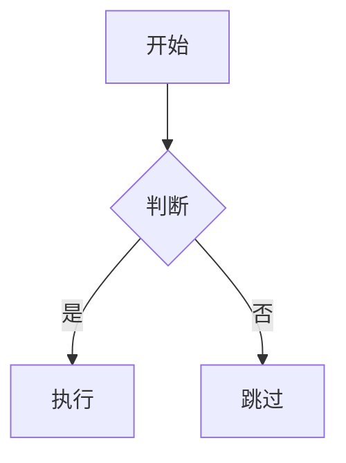
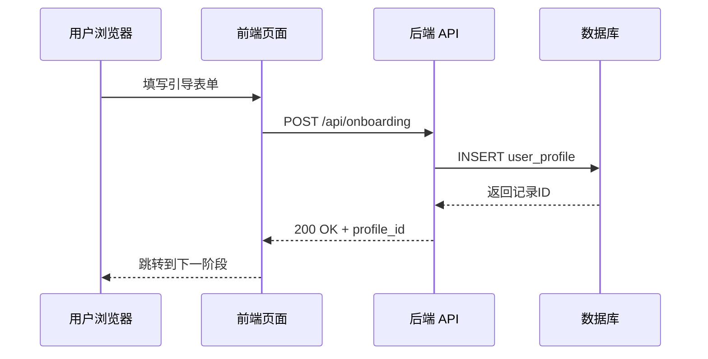
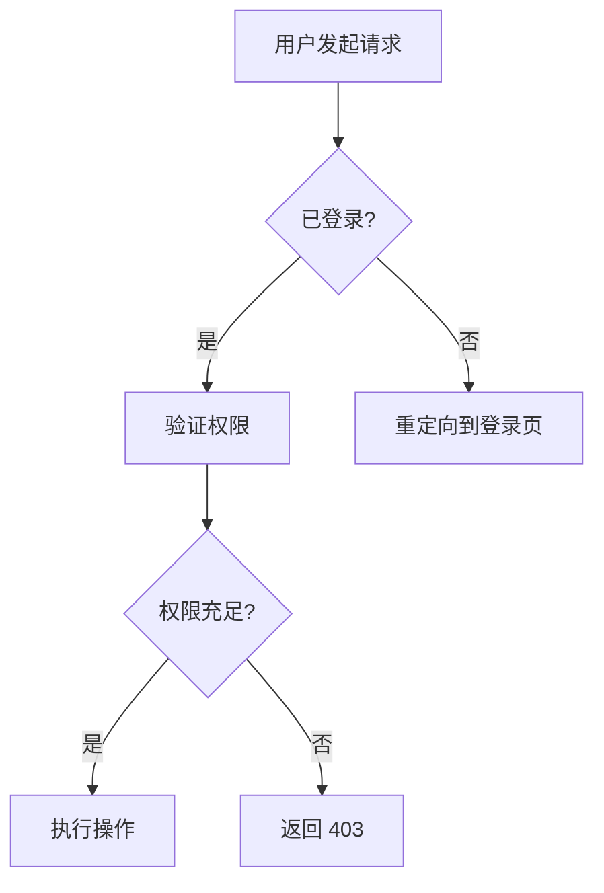
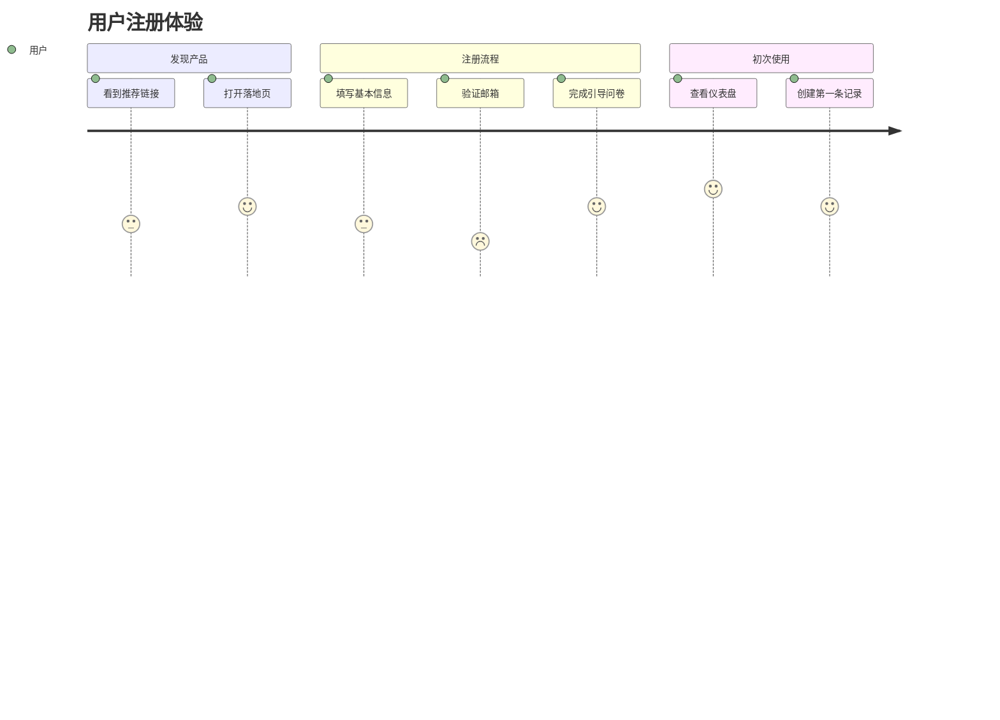

# Mermaid 图示通用指南

> 写作时根据内容语境动态选择图示类型，不绑定具体课次。

---

## 何时插入 Mermaid 图

当文字描述以下类型的结构化信息时，优先用 Mermaid 可视化：

| 内容语境 | 推荐图示类型 | Mermaid 语法 |
| --- | --- | --- |
| 流程/步骤/决策分支 | 流程图 | `flowchart TD` 或 `flowchart LR` |
| 多方交互/API 调用链 | 时序图 | `sequenceDiagram` |
| 数据表/实体关系 | ER 图 | `erDiagram` |
| 用户体验旅程/情感变化 | 用户旅程图 | `journey` |
| 状态变化/生命周期 | 状态图 | `stateDiagram-v2` |
| 模块架构/系统组成 | 架构图 | `block-beta` 或 `flowchart TD` |

**不需要图的情况：**
- 纯叙事段落（场景描述、个人感受）
- 内容太简单（2-3 个元素，文字说清楚就行）
- 已有表格足够表达

---

## 书写规则

### 1. 统一用 fenced code block

语言标记为 `mermaid`：

````

````

### 2. 节点命名

- **节点文字用中文**，连接线标签用中文
- **变量名用英文字母**（A、B、C 或有意义的缩写如 U、F、B、D）

```
正确：A[用户注册] -->|提交表单| B[后端验证]
错误：用户注册 -->|提交表单| 后端验证
```

### 3. 方向约定

- 流程图默认 `TD`（上到下），横向流程用 `LR`（左到右）
- 时序图自动从上到下，不需指定

### 4. 配色不硬编码

- 不使用 `style` 语句
- 保持主题中性，确保浅色/深色背景都可读

### 5. 复杂图拆分

- 单张图超过 15 个节点时，拆为多张子图并标注关系
- 每张子图加标题说明

---

## 常用示例

### 数据流转（时序图）



### 决策流程（流程图）



### 用户旅程图


